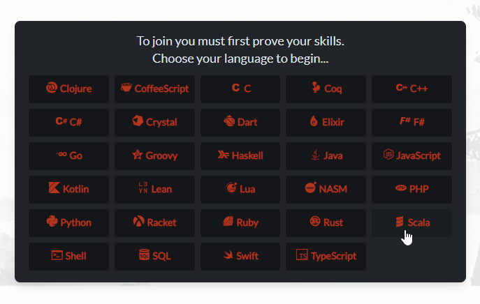
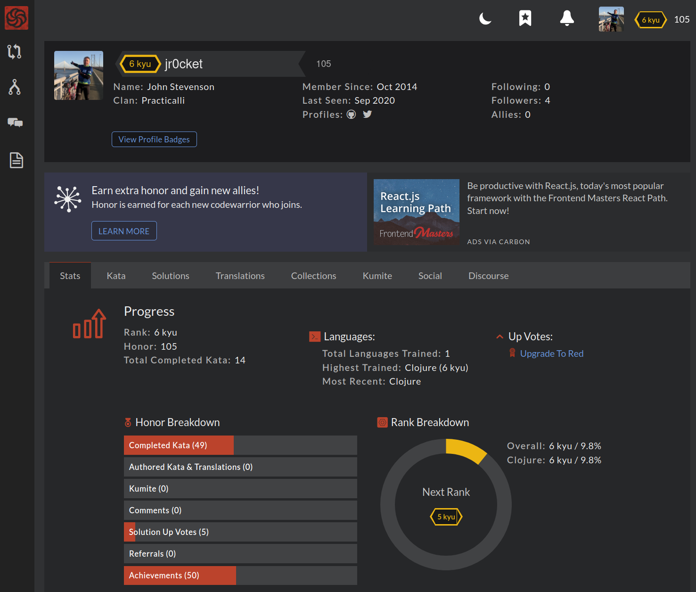
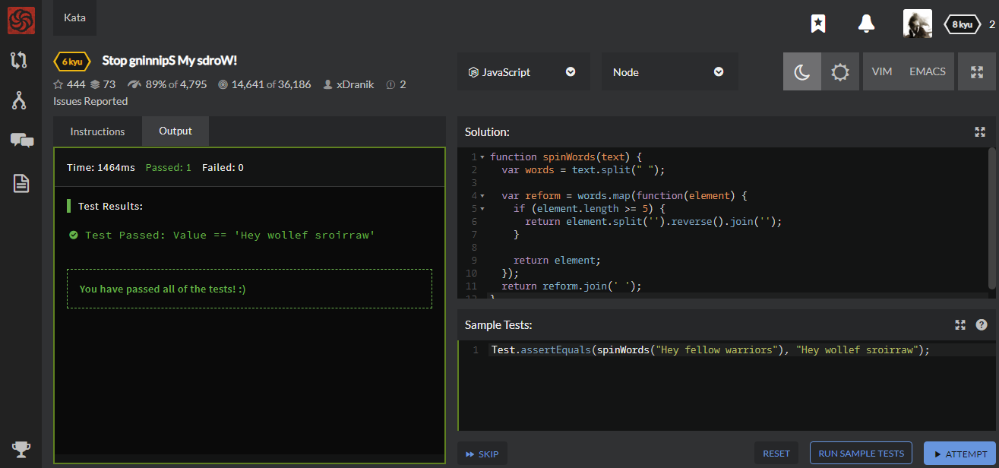
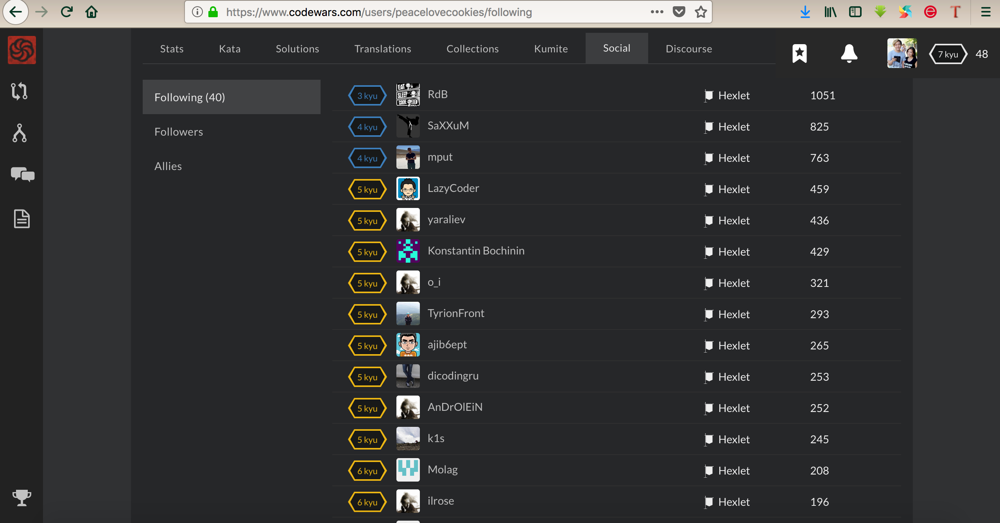

# Codewars - user documentation
Welcome! CodeWars is an online platform that provides a community-driven approach to 
learning programming through interactive coding challenges. It offers a
variety of coding exercises, ranging from beginner to advanced difficulty
levels, in multiple programming languages such as Python, JavaScript, Java,
Ruby, and more. Codewars is a place where you can proof your programming skills
and compete against other users.

# Getting Started
**Creating an Account**

To begin your CodeWars journey, you need to create an account on the CodeWars website. Follow the registration process, provide the necessary details, and set up your login credentials.

**Choosing a Programming Language**

CodeWars supports multiple programming languages. After creating an account, choose your preferred programming language to start solving katas in that specific language. You can switch between languages at any time.

**Understanding Ranks**

CodeWars utilizes a rank system to measure your coding skills. Starting at a beginner level, represented by a higher kyu number (e.g., 8 kyu), you can progress by solving katas and earning lower kyu ranks (e.g., 7 kyu, 6 kyu, and so on). The lower the kyu number, the higher your skill level.
# Features
* Coding Challenges (Katas): CodeWars offers a vast collection of coding challenges called "katas" that cover various programming topics and difficulty levels. Users can solve these challenges to improve their coding skills and learn new concepts.

* Community Interaction: CodeWars fosters community interaction through its platform. Users can compare and discuss their solutions with others, share insights, provide feedback, and engage in conversations about coding techniques and best practices.

* Solution Approvals and Rank Challenges: CodeWars has a system where solutions are approved by other users. This ensures quality control and encourages users to submit well-optimized and efficient code. Users can also challenge the rank of a specific kata solution if they believe it deserves a higher or lower rank.

* User-Created Katas: CodeWars allows users to create their own katas and share them with the community. This feature promotes user engagement and enables the community to continually generate new coding challenges, ensuring a diverse range of learning opportunities.
# Katas

* Finding and Selecting a Kata
* CodeWars offers a vast collection of katas covering various programming topics and difficulty levels. To find a kata, use the search bar or browse the available categories. Once you find a kata of interest, click on it to access the kata details page.

* Solving a Kata
Read the instructions and requirements of the kata carefully. Use your programming skills to solve the challenge by writing code that meets the specified criteria. You can test your code with the provided sample test cases to ensure it works correctly.

* Submitting Solutions
After solving a kata, submit your solution on the kata page. Ensure your code follows the specified requirements and passes the provided test cases. You can submit multiple solutions to a kata, exploring different approaches.

Reviewing Solutions
CodeWars encourages community interaction and learning from each other. You can review and compare other users' solutions on the kata page. Study different approaches, analyze code optimizations, and gain insights into alternative solutions.
# Community Interaction

* Discussions and Comments
Engage in discussions and comment threads on katas and solutions. Share your thoughts, ask questions, and learn from other developers. Contribute to the community by providing helpful insights, discussing different approaches, and promoting collaboration.

*  Feedback
Offer constructive feedback on other users' solutions. Share suggestions for improvement, highlight areas of excellence, and provide helpful tips and explanations. By providing feedback, you contribute to a supportive learning environment.

* Challenging Kata Solutions
If you believe a solution deserves a higher or lower rank, you can challenge it. Other users will review the challenge, and if a consensus is reached, the solution's rank may be adjusted accordingly. Challenging solutions helps maintain the quality and accuracy of ranks.
# Profile and Progress
Managing Your Profile
Customize your CodeWars profile to reflect your programming journey. Add a bio, choose a profile picture, and set visibility options for your solutions and contributions. You can also connect with other users and view their profiles.

Tracking Your Progress
CodeWars provides tools to track your progress and improvement as a programmer. Monitor the katas you've solved, view your rank history, and set personal goals to challenge yourself. Tracking your progress helps you measure your growth and set new targets.
# Frequently Asked Questions (FAQ)
Browse through the FAQ section to find answers to common questions about using CodeWars. The FAQ covers general inquiries, troubleshooting issues, and provides guidance on using the platform effectively.

This concludes the overview of the CodeWars User Documentation. Use this resource to enhance your coding skills, engage with the CodeWars community, and embark on a rewarding coding journey. Happy coding!

